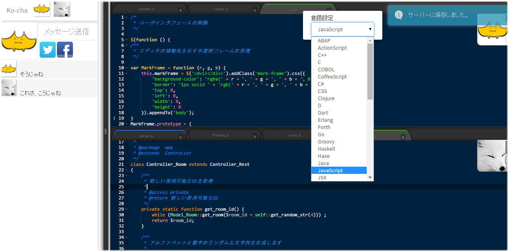

# Ko-cha2

コーディングチャットを手軽に始められるWebアプリです。[English](https://translate.google.com/translate?sl=ja&tl=en&u=https://github.com/setchi/ko-cha2) (by Google Translate)

[https://setchi.jp/ko-cha2/](https://setchi.jp/ko-cha2/)

自身のコードを共有・編集しながらチャットが出来ます。
共有したいファイルをドラッグ&ドロップするか、タブエリアをダブルクリックして空タブを開きます。
通信は基本的にWebRTCで行っています。Ctrl+Sでサーバ上にコードを記憶することもできます。

## できること
- 部屋のパスワード設定
- コードのリアルタイム共有
  - 複数ファイル可
  - ファイルドロップで表示, 言語は拡張子から識別
  - エディタのタブエリアをダブルクリックで空タブ生成
- リアルタイムチャット
  - 画像やその他ファイル送信に対応(ドラッグ＆ドロップで送信、最大5MBまで)
- Twitter/Facebookのアイコンをインポート
- 表示エディタ切り替え
  - 左上のViewerアイコンをクリック
- エディタのレイアウト変更
  - 2 columns or 2 rows
  - 左上のViewerアイコンをエディタ部分にドロップした位置によって変更
- タブを右クリックで各種設定変更
(ラベル名/言語/カラーテーマ/フォントサイズ)
- Ctrl + Sで自身のエディタの状態をサーバに記憶
- ブラウザを最小化してる時にチャットが来た場合、デスクトップに通知
  - ブラウザ側でデスクトップ通知を許可している場合のみ
- ドロップされたファイルの更新監視
  - 外部のテキストエディタなどで更新・保存した内容を反映

## 動作環境
下記の環境で動作を確認しています。

* Apache 2.4.6
* PHP 5.6.30
* MySQL 5.7

## ビルド
* fuel/app/config/内のdb.phpとopauth.phpの設定が必要です。

## LICENSE
MIT
